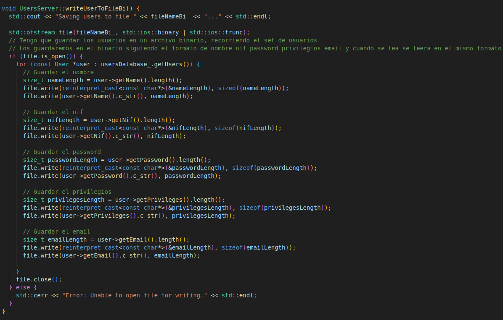
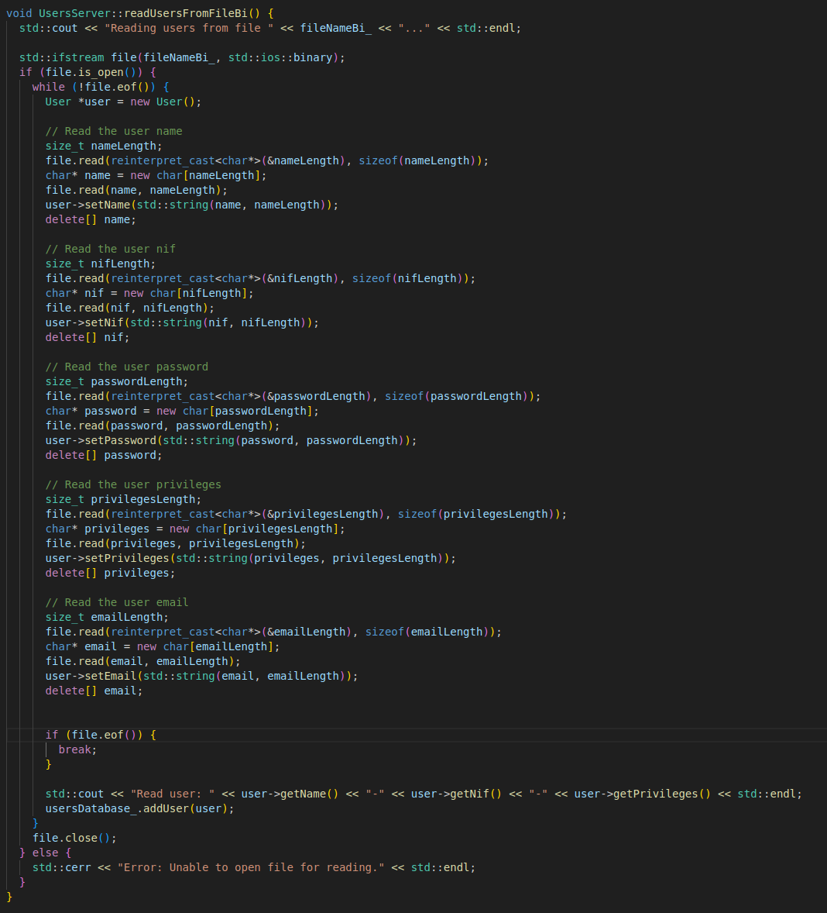
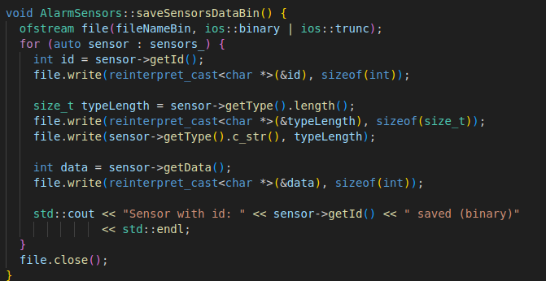
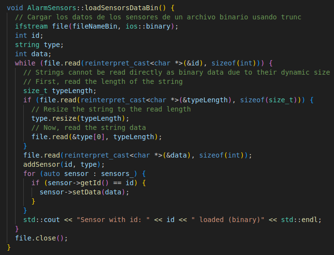
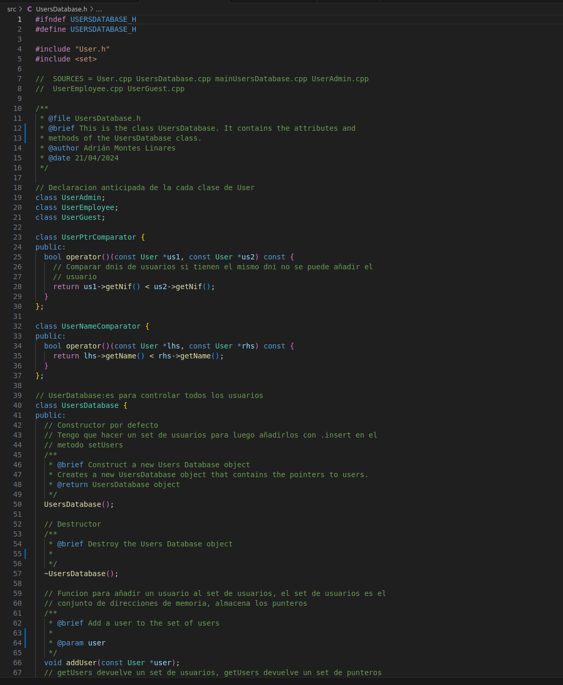

# P8-Ficheros_23-24

## Autor: Adrián Montes Linares

## Introducción

El programa principal se encuentra en main.cpp donde podremos lanzar el sistema del invernadero y realizar todas las operaciones posibles. Como compilar el main.cpp y ejecutar el programa se enseñara más adelante.
De momento muestro todas las clases, una explicación breve de ellas y que SOURCES tiene que tener el MakeFile para probar cada clase

1. User.cpp = Define los métodos y atributos básicos de un usuario.
```make
SOURCES = User.cpp mainUser.cpp
```
2. UserAdmin.cpp = Clase de Usuario administrador
```make
SOURCES = User.cpp UserAdmin.cpp mainUserAdmin.cpp
```
3. UserEmployee.cpp = Clase de Usuario employee
```make
SOURCES = User.cpp UserEmployee.cpp mainUserEmployee.cpp
```
4. UserGuest.cpp = Clase de Usuario guest
```make
SOURCES = User.cpp UserGuest.cpp mainUserGuest.cpp
```
5. UserDatabase.cpp = Define los métodos y atributos básicos de una base de datos que almacena usuarios. (Maneja a cada usuario de manera individual de una base de datos)
```make
SOURCES = User.cpp UsersDatabase.cpp mainUsersDatabase.cpp UserAdmin.cpp UserEmployee.cpp UserGuest.cpp
```
6. UsersServer.cpp = Define los métodos y atributos básicos de un servidor que maneja una base de datos. (Maneja al conjunto de usuarios de una base de datos)
```make
SOURCES = User.cpp UsersDatabase.cpp mainUsersServer.cpp UsersServer.cpp UserAdmin.cpp UserEmployee.cpp UserGuest.cpp
```
7. Camera.cpp = Define los métodos y los atributos básicos de una cámara (no esta creado un mainCameras.cpp)
```make
SOURCES = Camera.cpp mainCameras.cpp
```
8. TemperatureCamera.cpp = Define los métodos y los atributos básicos de una cámara termica
```make
SOURCES = Camera.cpp TemperatureCamera.cpp mainTemperatureCamera.cpp
```
9. RGBCamera.cpp = Define los métodos y los atributos básicos de una cámara RGB
```make
SOURCES = Camera.cpp RGBCamera.cpp mainRGBCamera.cpp
```
10. ManageCameras.cpp = Define los métodos y los atributos básicos para controlar las cámaras del sistema
```
SOURCES = Camera.cpp TemperatureCamera.cpp RGBCamera.cpp mainmanageCamera.cpp
```
11. Sensor.cpp = Define los métodos y atributos básicos de un sensor
```make
SOURCES = Sensor.cpp mainSensor.cpp
```
12. TemperatureSensor.cpp = Define los métodos y atributos de un sensor de temperatura
```make
SOURCES = Sensor.cpp TemperatureSensor.cpp mainTemperatureSensor.cpp
```
13. AirQualitySensor.cpp = Define los métodos y atributos de un sensor de aire
```make
SOURCES = Sensor.cpp AirQualitySensor.cpp mainAirQualitySensor.cpp
```
14. HydrometerSensor.cpp = Define los métodos y atributos de un hydrometro
```make
SOURCES = Sensor.cpp HydrometerSensor.cpp mainHydrometerSensor.cpp
```
15. PressureSensor.cpp = Define los métodos y atributos de un sensor de presión
```make
SOURCES = Sensor.cpp PressureSensor.cpp mainPressureSensor.cpp
```
16. LightSensor.cpp = Define los métodos y atributos de un sensor de luz
```make
SOURCES = Sensor.cpp LightSensor.cpp mainLightSensor.cpp
```
17. PhSensor.cpp = Define los métodos y atributos de un sensor de pH
```make
SOURCES = Sensor.cpp PhSensor.cpp mainPhSensor.cpp
```
18. Hardware.cpp = Define los métodos y atributos de un hardware generico (pantalla/teclado/interruptor)
```make
SOURCES = Hardware.cpp mainHardware.cpp 
```
19. ScreenHardware.cpp = Define los métodos y atributos necesarios de una pantalla
```make
SOURCES = Hardware.cpp mainScreenHardware.cpp ScreenHardware.cpp
```
20. KeyboardHardware.cpp = Define los métodos y atributos necesarios de un teclado
```make
SOURCES = Hardware.cpp mainKeyboardHardware.cpp KeyboardHardware.cpp
```
21. SwitchHardware.cpp = Define los métodos y atributos necesarios de un interruptor
```make
SOURCES = Hardware.cpp mainSwitchHardware.cpp SwitchHardware.cpp
```
22. AlarmSensors.cpp = Define los métodos y atributos necesarios para manejar todos los sensores y sus alarmas
```make
SOURCES = Sensor.cpp TemperatureSensor.cpp AirQualitySensor.cpp HydrometerSensor.cpp PressureSensor.cpp LightSensor.cpp PhSensor.cpp mainAlarmSensor.cpp AlarmSensor.cpp
```
23. MonitoringSystem.cpp = Define los métodos y atributos necesarios para manejar el sistema implementando un hardware de cada tipo
```make
SOURCES = Hardware.cpp MonitoringSystem.cpp mainMonitoringSystem.cpp KeyboardHardware.cpp ScreenHardware.cpp SwitchHardware.cpp
```
24. GreenHouse.cpp = Define los métodos y atributos necesarios para lanzar el sistema del invernadero, controlarlo, ver los sensores, usuarios y el resto de funciones según el rol que tengamos. Por defecto siempre hay tres usuarios, uno de cada tipo
* Nombre NIF Contraseña Privilegios Correo:
- admin 12345678X admin ADMIN admin@example.com
- employee 12345678Y employee EMPLOYEE employee@example.com
- guest 12345678Z guest GUEST guest@example.com

```make
SOURCES =  main.cpp GreenHouse.cpp Camera.cpp TemperatureCamera.cpp RGBCamera.cpp ManageCameras.cpp AlarmSensors.cpp UsersServer.cpp MonitoringSystem.cpp AirQualitySensor.cpp Hardware.cpp HydrometerSensor.cpp KeyboardHardware.cpp LightSensor.cpp TemperatureSensor.cpp UserAdmin.cpp UserGuest.cpp UserEmployee.cpp User.cpp PhSensor.cpp PressureSensor.cpp ScreenHardware.cpp Sensor.cpp SwitchHardware.cpp UsersDatabase.cpp
```
                                                                   
## Objetivos de la práctica
- Crear el guardar en ficheros binarios, en este caso tanto los datos de los Usuarios como los datos de los Sensores
### Usuarios
- Ya se guardaban en un users.txt, ahora también en un users.dat. Se guardan los usuarios tanto en plano como en binario y se leen actualmente del archvio binario, pero cambiando una línea se puede leer los usuarios del users.txt en vez del users.dat

1. WriteUsersBinario


2. ReadUsersBinario


### Sensores
- Al igual que los usuarios, se guardan en plano y en binario, y actualmente se cargan los datos en binario, pero cambiando una línera se puede leer los usuarios del sensors.txt en vez del sensors.dat

1. WriteSensorsBinario


2. ReadSensorsBinario



## Doxygen
- Gracias a Doxygen si nuestro programa tiene comentarios enriquezidos podemos generar una documentación en HTML y en LATEX, a continuación los pasos para generar la documentación:
1. Comentarios Enriquezidos

2. Generar fichero configuración Doxyfile
```bash
doxygen -g
```
3. Configurar el fichero doxygen (ruta donde generar los HTML y el LATEX, idioma, versión de nuestra documentación...)
4. Ejecutar Doxygen
```bash
doxygen Doxyfile
```
5. Ahora podemos ver el HTML en la carpeta de HTML generada, el fichero principal es index.html
6. Ahora con el LATEX podemos compilarlo en un pdf (refman.pdf), es tan sencillo como usar el Makefile:
```bash
make
```

## Compilar y ejecutar
### Compilar
- Con el siguiente comando se compila todos los .cpp que se encuntren en SOURCES
```bash
make
```
- Con el siguiente comando se limpia todos los .o de los .cpp que se encuetren en SOURCES
```bash
make clean
```
- Con el siguiente comando se le aplican unas normas de estilo a los .cpp y a los .h
```bash
make set_style
```
### Ejecutar
Por defecto el SOURCES tiene todo lo necesrio para compilar el programa principal **main.cpp**. Aquí están los pasos
1. Comprobar que el SOURCES es el necesario para compilar main.cpp, por defecto esta puesto el SOURCES correcto:
```make
SOURCES =  main.cpp GreenHouse.cpp Camera.cpp TemperatureCamera.cpp RGBCamera.cpp ManageCameras.cpp AlarmSensors.cpp UsersServer.cpp MonitoringSystem.cpp AirQualitySensor.cpp Hardware.cpp HydrometerSensor.cpp KeyboardHardware.cpp LightSensor.cpp TemperatureSensor.cpp UserAdmin.cpp UserGuest.cpp UserEmployee.cpp User.cpp PhSensor.cpp PressureSensor.cpp ScreenHardware.cpp Sensor.cpp SwitchHardware.cpp UsersDatabase.cpp
```
2. Compilar con el comando del apartado anterior:
```bash
make
```
3. Ejecutar el programa, cualquier programa se ejecutara como a continación independientemente del SOURCES del MakeFile
```bash
./main
```